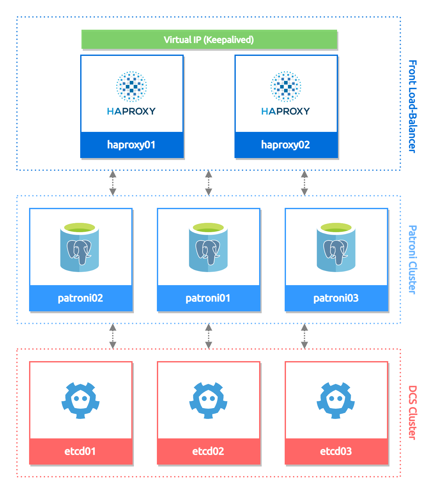

*Patroni is a template for you to create your own customized, high-availability solution using Python and - for maximum accessibility - a distributed configuration store like ZooKeeper, etcd, Consul or Kubernetes. Database engineers, DBAs, DevOps engineers, and SREs who are looking to quickly deploy HA PostgreSQL in the datacenter-or anywhere else-will hopefully find it useful*

## General informations

This repository contains configurations for deploying a PostgreSQL HA cluster using Zalando Patroni for training purpose).

### Overview

### Components

  - **PostgreSQL version** : `14.1`
  - **Patroni version** : `2.1.2`
  - **DCS (Distributed Configuration Store)** : etcd `3.5.0`
  - **Base OS** : Fedora 35

### Nodes description

The cluster is composed of three main "sub-clusters" :

* **Front Load-Balancer cluster**

  - 2x **HAProxy LB** in Active/Passive mode with failover IP address managed by Keepalived

* **PostgreSQL cluster**

  - 3x **PostgreSQL** instances in streaming replication managed by Patroni (primary election, switch-over...etc)

* **DCS cluster**

  - 3x **etcd** nodes in HA cluster (to provide lock mechanism and centralized configurations for Patroni)

## Deployment and administration

* **HAProxy Load Balancer**
  - [HAProxy](resources/front-lb/README.md#haproxy-installation)
  - [Keepalived VIP](resources/front-lb/README.md#keepalived)

* **DCS cluster bootstrap**
  - [etcd](resources/dcs/etcd/README.md)

* **Patroni**
  - [Patroni installation](resources/patroni/README.md#installation)

## References

- **PostgreSQL** : https://www.postgresql.org/
- **Patroni (Zalando)** : https://github.com/zalando/patroni
- **etcd** : https://etcd.io/
- **HAProxy** : https://www.haproxy.com/
